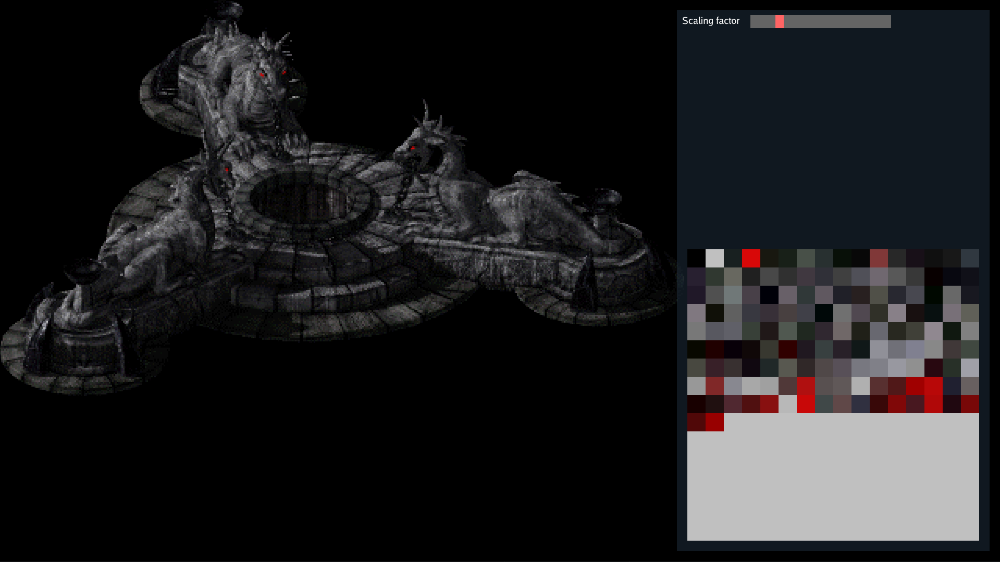

# RevenantRE
This code is my first attempt at reverse engineering the 1998 game Revenant.

*This program does not provide any game files. You need to own a copy of the game. GOG still sells the game for a few bucks.*

-----

## Basic information
There have been some attempts to reverse-engineer (the file formats) over the years with varying degrees of success. However, it seems like the only thing that worked was displaying `.dat` files. Luckily, some of those attempts were documented, and then the original source code - though not complete and written in 90s C, which is pretty foreign to me - was published on GitHub, which helped me figure things out. The original source code and the limited documentation of previous attempts, combined with help from some people on a private Discord server, resulted in successfully reverse-engineered 2D graphics file formats.

This program can display `.dat` files (imagery, not map data) and `.i2d` files, but to access the graphical assets (imagery files), you need to extract the `imagery.rvi` and `resources.rvr` files.

## Screenshot:

